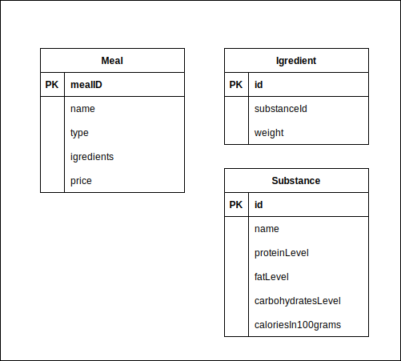

# Our Kitchen - Your Health

Our Kitchen - Your Health is a abstract company, which offer fresh food catering. They make your fresh, healthy meals and deliver to your house. This company need a strong, reliable system to: makes orders, manage orders, manage customers, manage meals, planning delivery.

# Microservices architecture

System is designed in microservices architecture. Each microservice has own bussines responsibility.

1. API gateway service
2. Security service
3. Eureka server
4. Registration microservice #TODO
5. Customer microservice #TODO //maybe i should connect 3. and 4.
6. Meals microservice
7. Orders microservice
8. Kitchen microservice
9. Delivery microservice
10. Demand microservice

[Structure](assets/Catering.svg)

## Client requirements
The customer is the owner of approximately 100 restaurants and serves daily diet meals over the phone. 
The demand for their services has consistently increased, and as a result, they require reliable software support to manage these orders.
The orders should be taken on a website, where clients can potentially choose their preferred meals for each day. The restaurant location, which will serve the meals, should be assigned based on the client's domicile.

Each day, the restaurants should have a list of ingredients to order for the following day.
Each day, the restaurants should have a list of meals to prepare for the following day.

The dietetics team should have the option to compose meals by adding ingredients and substances. 
These meals should be available for every client at any location.

## Meals microservice

Meals microservice offers access to ready to order meals, meals creator, ingredients adding, calories calculating.

